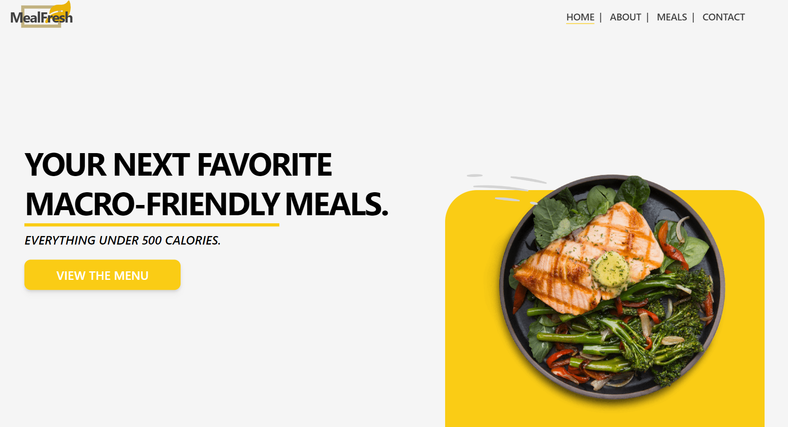
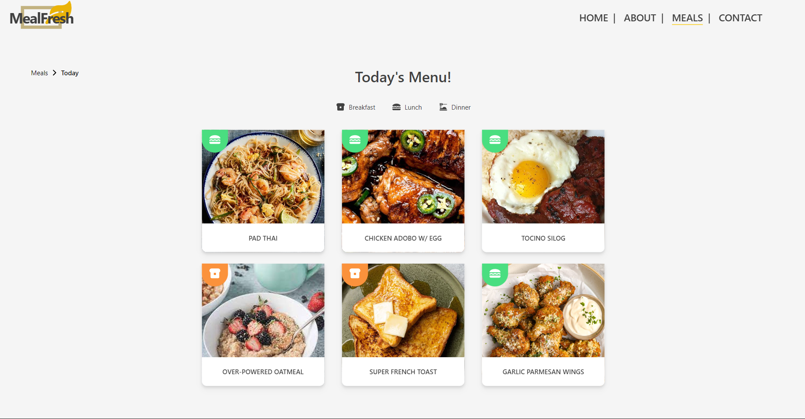
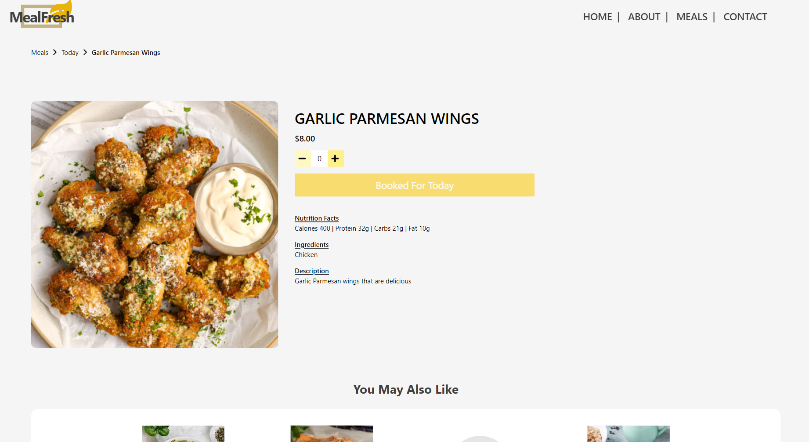
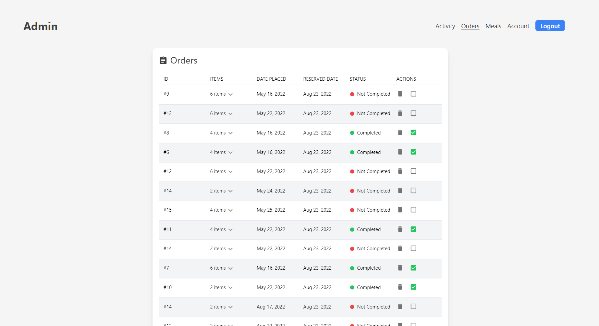
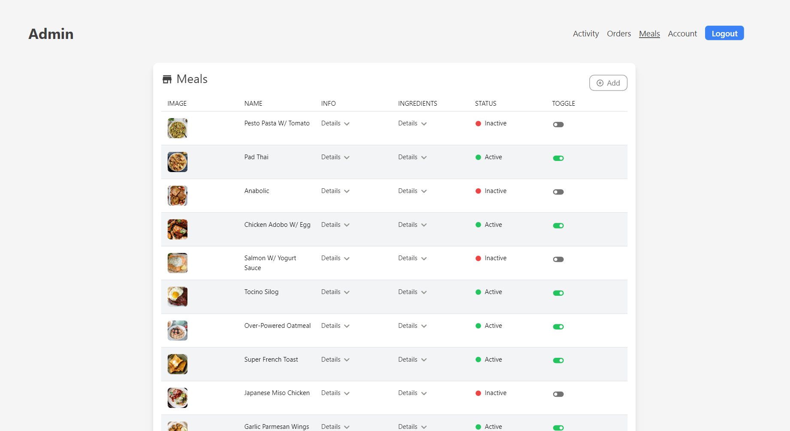
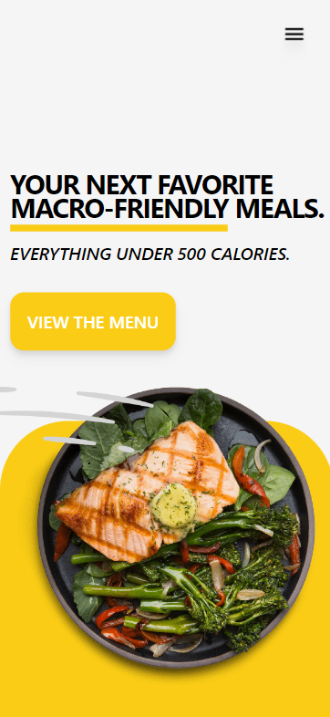
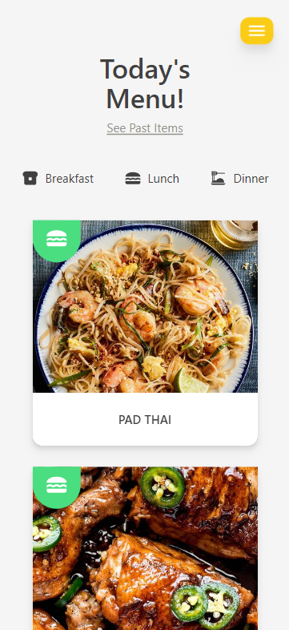
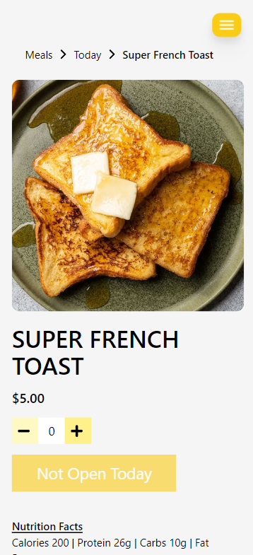

# Nathan's Meal Prep

> A web app created for client that displays information about their company and
> products. The application also features a content managing system and an ordering system.


## 🚀 Objective

> To improve and redesign the client's previous website and build a user portal
> that'll allow them to configure their meals, orders, and business avaibility
> dates.

## 📷 Screenshots

<ul style="display:flex flex-direction:column width:max">
 

    
  
  
</ul>

### Mobile Design

<ul style="display:flex">
  
  
   
</ul>

## ⚙ Technologies

### Front End:

-  React
-  React Router
-  Redux/Redux Toolkit
-  Tailwind CSS
-  Axios
-  Netlify

### Back End:

-  MongoDB
-  Express
-  Node.js
-  Firebase
-  Heroku
-  jsonwebtoken
-  bcrypt

## 📋 Features

-  Content Management System for Admin
   -  Create/add new products to their menu.
   -  Update product information such as price, description, image, etc.
   -  Decide when the store is open for business by toggling dates on a
      calendar.
   -  Manage past and new orders placed by customers.
-  Ordering System
   -  Allows users to add meals to their bag and place orders.
-  Responsive Web Design
-  Redux Global State for User's Shopping Bag
-  Emailjs Inegration
-  User Authentication

## 🛠 Installation & Setup

### Install

Clone down this repository. You will need node and npm installed globally on
your machine.

```
$ git clone https://github.com/jonathancarpena/nathans-meal-prep.git
```

1. Install project folder `npm install`
1. Install client packages `cd client` `npm install`
1. Install server packages `cd server` `npm install`

### Environment Variables

To run this project, you will need to add the following environment variables to
your `.env` file inside the server folder.

`MONGO_URI`: Register a new cluster in MongoDB Atlas and record your Mongo URI

`TOKEN_KEY`: a randomly generated string of numbers and letters. (Ex.
"8c6b1abd9d8c44eb")

### Scripts

Development mode. Open http://localhost:3000 to view it in the browser. Server
will run on PORT:5000

```
npm run dev
```

Server-side. (PORT:5000) Open http://localhost:5000 to access.

```
npm run server
```

Client-side. (PORT:3000) Open http://localhost:3000 to view it in the browser.

```
npm run client
```
